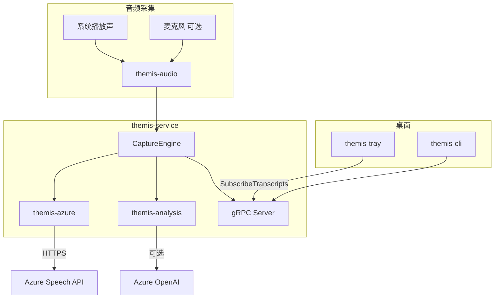
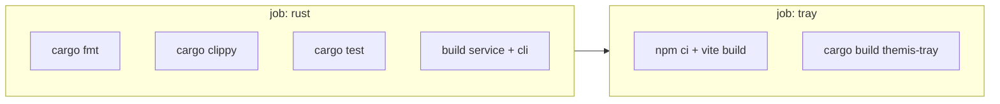

# Themis

**Themis（忒弥斯）** — 以 **系统音频输出**（电脑正在播放的声音）为主做实时听写；在会议等场景下可 **自动或手动同时采集麦克风**，混合后送入 Azure Speech，由托盘浮层 `themis-tray` 展示字幕与 Insights 侧栏。

> **默认**只抓系统播放声，不是全程麦克风录音。与物理扬声器、系统音量条无直接关系。  
> **例外：** `THEMIS_AUDIO_CAPTURE_MODE=auto` 且检测到 Zoom/Teams 等通话 app 时，会 **输出 + 麦克风双路混合**；也可显式设为 `call` / `dual`。macOS 在 Process Tap 不可用时可回退到纯麦克风（`input`）。  
> v0.1 不包含 iOS 系统内录（见 [docs/platform-notes.md](docs/platform-notes.md)）。

---

## 目录

1. [功能说明与使用场景](#1-功能说明与使用场景)
2. [安装与使用（Release 版）](#2-安装与使用release-版)
3. [触发 Release Pipeline](#3-触发-release-pipeline)
4. [本地编译与调试](#4-本地编译与调试)
5. [架构设计与 CI/CD](#5-架构设计与-cicd)
6. [其他参考](#6-其他参考)

---

## 1. 功能说明与使用场景

### 1.1 做什么

| 能力 | 说明 |
|------|------|
| **实时字幕** | 抓取系统播放声（必要时 + 麦克风）→ Azure STT → 浮层逐句显示（partial 灰色、final 黑色累积） |
| **Insights 侧栏** | 每句 final 后分析 **关键词 / 术语解释 / 问题初答**（启发式 + 可选 Azure OpenAI） |
| **全文总结** | 会话级摘要（需 LLM 配置时效果更好） |
| **延迟诊断** | 独立窗口查看 STT / 启发式 / LLM 各阶段耗时 |
| **迷你浮标** | 缩小为圆形浮标，不占屏幕空间 |
| **始终置顶浮层** | 可调透明度、主题、字号；支持居中 ⅓ 屏唤醒 |

### 1.2 适用场景与解决的痛点

| 场景 | 痛点 | Themis 如何解决 |
|------|------|-----------------|
| 看英文/技术 **视频、播客、网课** | 听不清术语、来不及查 | 系统 loopback 抓声 + 实时字幕 + 术语卡片 |
| **线上会议**（Zoom/Teams 等） | 记不全、专有名词难懂 | `auto` 检测到通话 app 时 **系统声 + 麦克风** 双路混音；也可强制 `dual` |
| **跨语言内容** | 中英混杂识别差 | `AZURE_SPEECH_LANGUAGE=auto` + 本地术语纠错（如 Reg→RAG） |
| **不想装重型会议软件** | 只要字幕，不要录屏 | 轻量托盘 + 浮层，后台 `themis-service` |
| **开发者自托管** | 要可控、可扩展 | Rust 单体仓库、gRPC、可选 Mock STT、词表可改 |

**不适合：** 仅画面有字幕、没有旁白（不做 OCR）；完全离线（需 Azure Speech，Mock 仅联调 UI）。

### 1.3 浮层布局（v0.1）

```
┌─────────────────────────────────────────────┐
│  标题栏 · 采集/诊断/主题/隐藏/退出            │
├─────────────────────────────────────────────┤
│  全文总结（Session Summary）                  │
├──────────────────┬──────────────────────────┤
│  Questions       │  Terms / Keywords        │
├──────────────────┴──────────────────────────┤
│  实时字幕（Transcript）                        │
└─────────────────────────────────────────────┘
```

### 1.4 快捷键

Windows 用 **Ctrl+Shift+**；macOS 用 **Cmd+Shift+**。

| 操作 | 快捷键 | 说明 |
|------|--------|------|
| 开始/停止采集 | `T` | 核心操作 |
| 唤醒/置顶浮层（居中 ⅓ 屏） | `O` | 浮层被挡或隐藏后找回 |
| 延迟诊断窗口 | `D` | STT / 分析拆分 |
| 显示/隐藏字幕区 | `H` | 只藏字幕条 |
| 迷你浮标模式 | `M` | 缩成圆形图标 |
| 浮层透明度 − / + | `[` / `]` | |
| 切换浮层风格 | `S` | dark-glass、light-glass、high-contrast 等 |
| 背景自适应对比 | `A` | **仅 Windows** 采样桌面亮度 |
| 字号 − / + / 重置 | `-` / `=` / `0` | |
| 退出托盘应用 | `Q` | |
| 显示/隐藏浮层 | 左键 **系统托盘**图标 | 不要用任务栏固定按钮（见 [6.4](#64-常见问题)） |
| 托盘菜单 | 右键 **系统托盘**图标 | 显示/隐藏/采集/诊断/退出 |

风格预设：`dark-glass`、`light-glass`、`high-contrast-dark`、`high-contrast-light`、`outline` 等。

### 1.5 音频采集：输出 vs 输入

Themis **默认只抓系统播放声**（输出）；在特定模式或检测到通话 app 时 **会同时抓麦克风**（输入）。两路音频在服务端 **混成一条流** 再送 STT。

| 采集对象 | 何时启用 | 典型场景 |
|----------|----------|----------|
| **系统音频输出** | 几乎总是（`auto` / `process` / `process_tap` 等） | YouTube、播客、会议里对方说话（从扬声器/耳机输出混音） |
| **麦克风（输入）** | ① `auto` 且检测到 Zoom/Teams/Discord 等通话 app<br>② 显式设 `call` 或 `dual`<br>③ macOS 设 `input`（或 tap 失败回退） | 会议中 **你说的话**、需同时转写本地发言 |
| **仅麦克风** | macOS：`THEMIS_AUDIO_CAPTURE_MODE=input` | 无 Process Tap、用 BlackHole 等虚拟设备当输入 |

**默认 `THEMIS_AUDIO_CAPTURE_MODE=auto` 行为：**

| 平台 | 平时（无通话 app） | 检测到通话 app 时 |
|------|-------------------|-------------------|
| **Windows** | 仅 **输出** loopback（process 或 endpoint） | **输出 + 麦克风**（`capture=dual`） |
| **macOS** | 仅 **Process Tap**（系统播放） | **Process Tap + 麦克风**（`capture=dual`） |

强制始终双路：`THEMIS_AUDIO_CAPTURE_MODE=dual`（或 `call`）。  
只要输出、不要麦克风：Windows 用 `process` / `endpoint`；macOS 用 `process_tap`（勿设 `dual`/`call`，且勿在通话 app 运行时保持 `auto`——此时会自动加麦）。

可选 `THEMIS_AUDIO_INPUT_DEVICE=设备名子串` 指定麦克风（如 `Jabra`）。浮层 Status 行在双路时会显示 `capture=dual` 及 `output loopback + microphone` 等说明。

检测到的通话类进程包括（进程名子串匹配）：Zoom、Teams、FaceTime、Discord、Webex、Slack、Skype、腾讯会议、飞书、企业微信、WhatsApp 等（完整列表见 [`call_detect.rs`](crates/themis-audio/src/call_detect.rs)）。

---

## 2. 安装与使用（Release 版）

### 2.1 下载 Release

1. 打开 GitHub 仓库 **Releases** 页（标签形如 `v0.1.0` 的发布）。
2. 若尚无 Release，需维护者先 [触发 Release Pipeline](#3-触发-release-pipeline)；在此之前只能从 [源码构建](#4-本地编译与调试)。

| 平台 | 下载文件 | 说明 |
|------|----------|------|
| **Windows x64** | `themis-windows-x86_64.zip` | 含 `themis-service.exe`、`themis-cli.exe`、Tauri 安装包目录 |
| **macOS Apple Silicon** | `themis-macos-aarch64.zip` | 同上 + `.app` / `.dmg` 等 bundle |
| **macOS Intel** | `themis-macos-x86_64.zip` | 同上 |

zip 内 `tauri-bundle/` 通常包含：

- **Windows**：`.msi`（WiX）或 `.exe`（NSIS 安装程序）
- **macOS**：`.dmg` 或 `.app`

也可 **免安装便携运行**：解压后直接使用其中的 `themis-tray` 可执行文件（见下文）。

### 2.2 环境要求

| 项目 | 版本 |
|------|------|
| Windows | 10+（进程 loopback 需 20H1+） |
| macOS | 14.2+（推荐 Process Tap；首次需 **系统音频录制** 权限） |
| Azure | Speech 资源 Key + Region（无 Key 时 Mock，无真实听写） |
| 可选 | Azure OpenAI（`FOUNDRY_*`）增强 Insights |

### 2.3 首次配置（`.env`）

1. 在 [Azure Portal](https://portal.azure.com/#create/Microsoft.CognitiveServicesSpeechServices) 创建 **Speech** 资源，记下 Key 与 Region。
2. 复制模板并填写：

```powershell
# Windows — 放在 exe 同目录或上级目录
copy .env.example .env
```

```bash
# macOS
cp .env.example .env
```

3. 编辑 `.env`，至少设置：

```env
AZURE_SPEECH_KEY=你的_key
AZURE_SPEECH_REGION=eastus
```

程序会从 **当前工作目录** 或 **可执行文件所在目录及其上级**（最多 8 层）查找 `.env`。Release 便携使用时，建议把 `.env` 与 `themis-tray.exe` 放在同一文件夹。

完整变量见 [.env.example](.env.example) 与 [6.1 配置说明](#61-配置说明env)。

### 2.4 Windows 安装与启动

#### 方式 A：安装包（推荐给非开发者）

1. 解压 zip，进入 `tauri-bundle/`
2. 运行 **NSIS `.exe`** 或 **MSI** 安装程序，按向导完成
3. 从开始菜单或桌面快捷方式启动 **Themis**
4. 将 `.env` 放到安装目录或 `%USERPROFILE%` 下某固定位置（需能被程序找到）；改配置后重启应用

#### 方式 B：便携（免安装）

1. 解压 zip 到例如 `C:\Tools\Themis\`
2. 同目录放置 `.env`
3. 双击 **`themis-tray.exe`**

`themis-tray` 会检测 gRPC；若 `themis-service` 未运行，会自动在同目录寻找并拉起 **`themis-service.exe`**（无需管理员）。

#### 通过界面使用

1. 看 **系统托盘**（任务栏右下角时钟旁，可能在「^」隐藏图标里）— 应只有 **一个** Themis 图标
2. **右键托盘** → 可「Toggle capture」或直接用 **`Ctrl+Shift+T`**
3. 浮层出现字幕后，右侧 Insights 随每句 final 更新
4. **`Ctrl+Shift+O`** 唤醒浮层；**`Ctrl+Shift+M`** 迷你模式

#### 通过命令行使用

在解压目录或已加入 PATH 的目录：

```powershell
# 仅后台服务（无 UI）
.\themis-service.exe

# 诊断 Azure / 配置
.\themis-cli.exe doctor

# 服务状态与采集诊断
.\themis-cli.exe status
.\themis-cli.exe audio-probe --seconds 8
```

日志：`%LOCALAPPDATA%\Themis\logs`

#### 可选：安装为 Windows 服务（需管理员）

详见 [packaging/windows/themis-service.md](packaging/windows/themis-service.md)：

```powershell
themis-cli service install
themis-cli service start
```

### 2.5 macOS 安装与启动

#### 方式 A：安装包

1. 解压 zip，打开 `tauri-bundle/` 中的 **`.dmg`**
2. 将 **Themis.app** 拖入「应用程序」
3. 在应用包同级或 `~/` 下配置 `.env`（或通过启动前 `export` 环境变量）
4. 首次运行允许 **系统音频录制**；若提示无法打开，在「隐私与安全性」中允许

#### 方式 B：便携

1. 解压 zip，终端进入目录
2. 放置 `.env` 后运行 bundle 中的 **`themis-tray`** 或 **Themis.app**

#### 通过界面 / 命令行

与 Windows 相同逻辑，快捷键改为 **Cmd+Shift+***。

```bash
./themis-cli doctor
./themis-cli status
./themis-cli audio-probe --seconds 8
```

日志：`~/Library/Logs/Themis`  
数据：`~/Library/Application Support/Themis`

可选 LaunchAgent：`themis-cli agent install` / `agent start`（见 [packaging/macos/com.themis.agent.plist](packaging/macos/com.themis.agent.plist)）。

### 2.6 快速验证是否正常

| 步骤 | Windows | macOS |
|------|---------|-------|
| 音频自检 | `.\themis-cli.exe audio-probe --seconds 8` | `./themis-cli audio-probe --seconds 8` |
| 播放 YouTube 等 | 同时运行 probe，应 `peak > 200` | 同左 |
| 开始采集 | `Ctrl+Shift+T` | `Cmd+Shift+T` |
| 浮层状态 | 非 `Service offline` | 同左 |

---

## 3. 触发 Release Pipeline

Release **不会**在普通 push 到 `main` 时自动运行；只有推送 **`v*` 标签** 才会触发 [`.github/workflows/release.yml`](.github/workflows/release.yml)。

### 3.1 与 CI 的区别

| 工作流 | 文件 | 何时运行 | 产出 |
|--------|------|----------|------|
| **CI** | `ci.yml` | push / PR 到 `main` | 格式、Clippy、测试、编译验证（**不打安装包**） |
| **Release** | `release.yml` | push 标签 `v*` | 多平台 zip + GitHub Release 页面 |

因此 Actions 里 **Release 显示 0 runs** 是正常的，直到有人推送第一个 `v*` 标签。

### 3.2 维护者：发布新版本

在项目根目录、且 `main` 已合并待发布内容：

```powershell
# 1. 确认代码已推送
git push origin main

# 2. 打标签（版本号自定，须以 v 开头）
git tag v0.1.0

# 3. 推送标签 —— 这一步触发 Release workflow
git push origin v0.1.0
```

推送标签后：

1. 打开 GitHub → **Actions** → **Release**，查看运行进度
2. 成功后 **Releases** 页会出现 `v0.1.0`，附件含：
   - `themis-windows-x86_64.zip`
   - `themis-macos-aarch64.zip`
   - `themis-macos-x86_64.zip`
3. Release 说明由 `generate_release_notes: true` 自动生成

### 3.3 Release 构建内容（各 job）

```
push tag v*
    │
    ▼
┌─────────────────────────────────────────────────────────┐
│  build (matrix)                                          │
│  · windows-latest  → x86_64-pc-windows-msvc              │
│  · macos-latest    → aarch64-apple-darwin                │
│  · macos-latest    → x86_64-apple-darwin                 │
│    ① cargo build --release themis-service + themis-cli   │
│    ② npm install + tauri build（含 NSIS/MSI 或 dmg）      │
│    ③ 打包 zip → upload-artifact                          │
└───────────────────────────┬─────────────────────────────┘
                            ▼
┌─────────────────────────────────────────────────────────┐
│  release (ubuntu-latest)                                 │
│    合并 artifacts → softprops/action-gh-release 上传      │
└─────────────────────────────────────────────────────────┘
```

CI 环境使用 `THEMIS_USE_MOCK_SPEECH=true`，**不需要**真实 Azure Key 即可编译。

### 3.4 重新发布 / 修正

- **同一标签不能重复推送**；若失败需修复后打新标签，如 `v0.1.1`
- 删除远程标签（慎用）：`git push origin :refs/tags/v0.1.0`

---

## 4. 本地编译与调试

### 4.1 环境要求

| 项目 | 版本 |
|------|------|
| Rust | stable（见 `rust-toolchain.toml`） |
| Node.js | 20+（仅 `themis-tray` 前端） |
| Windows | 10+ |
| macOS | 14.2+；Xcode CLT；`tray` 脚本会自动生成 `icon.icns` |

macOS 可选：[BlackHole](https://existential.audio/blackhole/)（仅 `THEMIS_AUDIO_CAPTURE_MODE=input` 时）。

### 4.2 一键脚本（推荐）

#### Windows（PowerShell 或 `dev.cmd` / `restart.cmd` / `tray.cmd`）

| 命令 | 作用 |
|------|------|
| `.\scripts\themis.ps1 dev` | 编译 + 后台启动 `themis-service` |
| `.\scripts\themis.ps1 restart` | 停止 → 编译 → 启动（改 Rust / `.env` 后用） |
| `.\scripts\themis.ps1 tray` | 服务 + Tauri 托盘（`tauri dev`，前台） |
| `.\scripts\themis.ps1 stop` / `status` / `doctor` / `probe` | 停止 / 状态 / 诊断 / 音频自检 |
| `.\scripts\themis.ps1 build -Release` | 仅 Release 编译服务 |

```powershell
copy .env.example .env   # 首次
.\scripts\themis.ps1 restart
.\scripts\themis.ps1 tray
```

#### macOS

```bash
chmod +x scripts/themis.sh dev.sh restart.sh tray.sh
cp .env.example .env
./scripts/themis.sh restart
./scripts/themis.sh tray
```

### 4.3 手动两终端

```powershell
# 终端 1 — Windows
cargo run -p themis-service

# 终端 2
cd apps\themis-tray
npm install
npm run tauri dev
```

```bash
# macOS 终端 1
cargo run -p themis-service

# 终端 2
cd apps/themis-tray && npm install && npm run tauri dev
```

浮层应显示 `Status: idle — …`；若 **Service offline**，说明 gRPC 未连上。

### 4.4 Release 二进制与安装包

```powershell
cd apps\themis-tray

# 仅编译 exe，跳过 WiX/NSIS 下载（日常最快）
npm run tauri build -- --no-bundle

# 完整安装包（首次会下载 WiX / NSIS，成功后缓存到 %LOCALAPPDATA%\tauri\）
npm run tauri build

# 只要 NSIS，不要 MSI
npm run tauri build -- --bundles nsis
```

产物路径：

| 产物 | 路径 |
|------|------|
| 服务 / CLI | `target/release/themis-service.exe`（Windows） |
| 托盘 exe | `target/release/themis-tray.exe` |
| 安装包 | `target/release/bundle/` 或 `apps/themis-tray/src-tauri/target/release/bundle/` |

重新生成托盘图标：`cd apps/themis-tray && npm run icons`

### 4.5 开发提示

- 改 `.env` 后必须 **`restart` 服务**（只关 tray 不够）
- `tauri dev` 任务栏图标可能是通用 Rust 图标；要看正式图标请跑 **release exe**
- 编译提示无法覆盖 `themis-service.exe` → 先 `.\scripts\themis.ps1 stop`
- Mock UI：`THEMIS_USE_MOCK_SPEECH=true` 后 restart

---

## 5. 架构设计与 CI/CD

### 5.1 端到端数据流

```
┌─────────────────────┐
│ 系统播放声（输出）   │──┐
└─────────────────────┘  │   WASAPI loopback /     ┌──────────────────────────────┐
                         ├── Process Tap ────────► │  themis-service              │
┌─────────────────────┐  │   （可选混音）           │  重采样 16 kHz → Azure STT   │
│ 麦克风（输入，可选） │──┘                         │  → Insights 分析 (可选 LLM)  │
└─────────────────────┘                            └────────┬─────────────────────┘
                                                            │ gRPC
                                                   ┌────────▼─────────┐
                                                   │  themis-tray     │
                                                   └──────────────────┘
```



### 5.2 Insights 分析流

```
Azure STT 输出 is_final 句子
        │
        ▼
themis-service ──► 先推送 gRPC（仅 text）──► 浮层立刻显示字幕
        │
        │ 异步 analyze(text)
        ▼
themis-analysis
  ① 启发式（词表 + 正则问句）— 必跑
  ② LLM（FOUNDRY_*）— 可选，12s 超时
        │
        ▼
再推送 gRPC（text + insights_json）──► 侧栏 Keywords / Terms / Questions
```

### 5.3 模块职责

| 组件 | 路径 | 作用 |
|------|------|------|
| `themis-core` | `crates/themis-core` | 配置、状态机、`.env` 加载 |
| `themis-audio` | `crates/themis-audio` | 系统输出 loopback / Process Tap；可选麦克风双路混音 |
| `themis-azure` | `crates/themis-azure` | Azure Speech（REST / Mock）、术语纠错 |
| `themis-analysis` | `crates/themis-analysis` | 启发式 + 词表 + 可选 LLM |
| `themis-ipc` | `crates/themis-ipc` | gRPC proto / 客户端 / 服务端 |
| `themis-service` | `crates/themis-service` | 后台：采集 → STT → 分析 → 推送 |
| `themis-cli` | `crates/themis-cli` | `doctor`、`status`、`audio-probe`、服务安装 |
| `themis-tray` | `apps/themis-tray` | Tauri 托盘、浮层 UI、全局快捷键 |

更细说明：[docs/architecture.md](docs/architecture.md)、[docs/platform-notes.md](docs/platform-notes.md)。

### 5.4 gRPC 接口（默认 `127.0.0.1:50051`）

| RPC | 说明 |
|-----|------|
| `StartCapture` / `StopCapture` | 开始/停止采集管线 |
| `GetStatus` | `idle` / `capturing` / `error` |
| `SubscribeTranscripts` | 流式 partial / final 文本 + `insights_json` |

### 5.5 CI Pipeline（`.github/workflows/ci.yml`）

**触发：** push / PR → `main`



| 步骤 | 目的 |
|------|------|
| `cargo fmt --check` | 格式统一 |
| `cargo clippy -D warnings` | 静态分析 |
| `cargo test`（core / ipc / azure） | 单元测试 |
| `cargo build --release` service + cli | 多平台编译服务 |
| `cargo build --release -p themis-tray` | 验证 Tauri 能编过（**不**打安装包，避免 CI 下载 WiX） |

矩阵：`windows-latest`、`macos-latest`。

### 5.6 Release Pipeline

见 [§3](#3-触发-release-pipeline)。与 CI 相比，Release 额外执行 **`npm run tauri build`** 生成安装包并发布 GitHub Release。

### 5.7 部署模式

| 模式 | 说明 |
|------|------|
| **便携（默认）** | 只跑 `themis-tray`；若无 gRPC 则同目录拉起 `themis-service` |
| **Windows 服务** | `themis-cli service install`（管理员） |
| **macOS LaunchAgent** | `themis-cli agent install` |

---

## 6. 其他参考

### 6.1 配置说明（`.env`）

| 变量 | 必填 | 说明 |
|------|------|------|
| `AZURE_SPEECH_KEY` / `REGION` | 是* | Speech 密钥与区域 |
| `AZURE_SPEECH_LANGUAGE` | 建议 | 默认 `auto`（中英） |
| `AZURE_SPEECH_MODE` | 否 | `rest`（默认 2s 分块）或 `streaming` |
| `THEMIS_STT_FIXUP` | 否 | 默认 `true`，Reg→RAG 等 |
| `AZURE_SPEECH_CORRECTIONS` | 否 | 自定义纠错；**含空格须加双引号** |
| `THEMIS_AUDIO_CAPTURE_MODE` | 否 | 见 [§1.5](#15-音频采集输出-vs-输入)。Win: `auto`/`process`/`endpoint`/`call`/`dual`；macOS: `auto`/`process_tap`/`input`/`call`/`dual` |
| `THEMIS_AUDIO_INPUT_DEVICE` | 否 | 双路或 `input` 模式下的麦克风设备名子串 |
| `THEMIS_AUDIO_OUTPUT_DEVICE` | 否 | **仅 Windows** `endpoint` 模式：播放设备名子串 |
| `FOUNDRY_*` | 否 | Azure OpenAI，增强 Insights |
| `THEMIS_ANALYSIS_ENABLED` | 否 | 默认 `true` |
| `THEMIS_GRPC_PORT` | 否 | 默认 `50051` |

\* 缺 Key 时自动 Mock。

**注意：** `AZURE_SPEECH_CORRECTIONS` 若含空格未加引号，会导致 **该行之后所有变量（含 `FOUNDRY_*`）加载失败**。

```bash
AZURE_SPEECH_CORRECTIONS="Reg:RAG,Regs:RAG,L L M:LLM,G P T:GPT"
```

改 `.env` 后：`.\scripts\themis.ps1 restart` 或 `./scripts/themis.sh restart`。

### 6.2 Insights 要点

- 仅 **final 句** 触发分析；画面 OCR 字幕 **不会** 进入 Insights
- 无 LLM 时仍可用 [`glossary.rs`](crates/themis-analysis/src/glossary.rs) 词表 + 启发式问句
- 扩展词表：编辑 `glossary.rs` 后 restart 并重新编译 service
- 诊断窗口 **`Ctrl+Shift+D`** 可看启发式 / LLM / 合并三路结果

### 6.3 音频采集要点

详见 [§1.5 音频采集：输出 vs 输入](#15-音频采集输出-vs-输入)。

**Windows（WASAPI）**

| 模式 | 输出 | 麦克风 |
|------|------|--------|
| `auto`（默认） | ✅ process 或 endpoint | ✅ 仅当检测到通话 app |
| `process` / `endpoint` | ✅ | ❌ |
| `call` / `dual` | ✅ | ✅ 始终 |

自检（只验证 **输出** 通路，不含麦克风）：

```powershell
.\scripts\themis.ps1 probe
# 或 cargo run -p themis-cli -- audio-probe --seconds 8
```

**macOS**

| 模式 | 输出（Process Tap） | 麦克风 |
|------|---------------------|--------|
| `auto`（默认） | ✅ | ✅ 仅当检测到通话 app |
| `process_tap` / `tap` | ✅ | ❌ |
| `input` | ❌（走默认输入设备） | ✅ |
| `call` / `dual` | ✅ | ✅ 始终 |

首次 Process Tap 需 **系统音频录制** 权限；双路或 `input` 时可能还需 **麦克风** 权限。详见 [docs/platform-notes.md](docs/platform-notes.md)。

| probe 结果 | 含义 |
|------------|------|
| `OK` + `peak > 200` | 输出通路正常 |
| `WARN` + 低 peak | 信号弱 |
| `FAIL` + `frames = 0` | 未采到数据 |

会议场景若只有对方、没有自己的话：确认 Status 是否为 `capture=dual`；若仍为 `process`/`process_tap`，检查通话 app 是否在运行，或改 `THEMIS_AUDIO_CAPTURE_MODE=dual`。

### 6.4 常见问题

**浮层 Service offline**  
→ 先 `dev` / `restart` 或确认 release 目录有 `themis-service.exe` 且 tray 能拉起它。

**任务栏两个图标 / 一个没菜单**  
→ 正常情况只应有一个 **系统托盘**图标（时钟旁）。若有两个：① 勿同时固定任务栏 + 托盘；② v0.1 曾存在 Tauri 双托盘 bug（配置 `trayIcon` + 代码各建一个），已移除配置项，需 **重新编译 release**。③ 诊断窗口打开时会多一个任务栏按钮。

**Release 从未运行**  
→ 需 push `v*` 标签，见 [§3](#3-触发-release-pipeline)。

**`tauri build` 下载很大文件**  
→ 打 MSI 需 WiX，首次下载后缓存在 `%LOCALAPPDATA%\tauri\`；日常用 `npm run tauri build -- --no-bundle`。

**Insights 为空**  
→ 确认 final 句、词表/问句规则、`THEMIS_ANALYSIS_ENABLED`、`.env` 引号问题；配置 LLM 用 `FOUNDRY_*` 非 Speech Key。

**听写 Reg 而非 RAG**  
→ 开 `THEMIS_STT_FIXUP` 或配置 `AZURE_SPEECH_CORRECTIONS`。

**macOS 缺 icon.icns**  
→ `./scripts/themis.sh icons`

### 6.5 诊断命令

```bash
cargo run -p themis-cli -- doctor
cargo run -p themis-cli -- status
cargo run -p themis-cli -- audio-probe --seconds 8
```

或 `./scripts/themis.sh doctor` / `probe`（Windows 用 `themis.ps1`）。

### 6.6 仓库结构

```
crates/themis-core      # 配置、状态机
crates/themis-audio     # 系统音频采集
crates/themis-azure     # Azure Speech + Mock
crates/themis-analysis  # Insights
crates/themis-ipc       # gRPC
crates/themis-service   # 后台服务
crates/themis-cli       # CLI
apps/themis-tray        # Tauri 托盘 + 浮层
scripts/themis.ps1      # Windows 脚本
scripts/themis.sh       # macOS 脚本
.github/workflows/      # ci.yml · release.yml
docs/                   # 架构与平台说明
packaging/              # 服务安装模板
```

### 6.7 License

MIT
