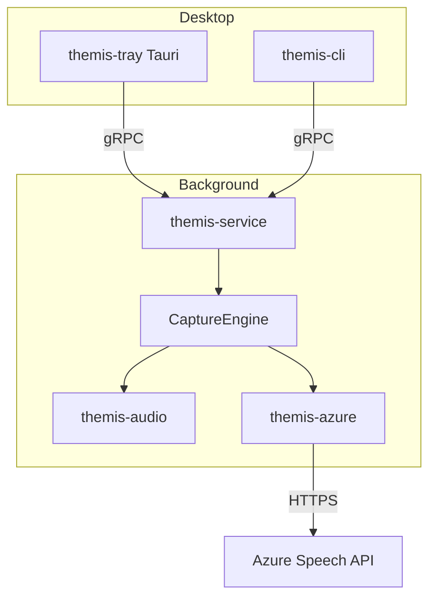

# Themis Architecture

## Overview

Themis captures system-played audio, streams PCM to Azure Speech for real-time transcription, and displays results in a lightweight tray application.

## Crates

| Crate | Role |
|-------|------|
| `themis-core` | Config, state machine, transcript types, analysis trait |
| `themis-audio` | Platform system-audio output capture (`AudioSource`, WASAPI loopback on Windows) |
| `themis-azure` | Speech recognizer (REST chunks + mock for dev/CI) |
| `themis-ipc` | gRPC proto and server/client |
| `themis-service` | Headless daemon: capture + Azure + gRPC |
| `themis-cli` | Service/LaunchAgent install, `status`, `doctor` |
| `themis-tray` | Tauri UI: tray, hotkey, overlay |

## IPC (gRPC)

Default bind: `127.0.0.1:50051` (`THEMIS_GRPC_PORT`).

| RPC | Description |
|-----|-------------|
| `StartCapture` | Begin loopback + speech pipeline |
| `StopCapture` | Stop pipeline |
| `GetStatus` | `idle` / `capturing` / `error` |
| `SubscribeTranscripts` | Server-stream partial/final text |

## Deployment modes

**Portable (default)**  
`themis-tray` spawns `themis-service` in the user session if gRPC is unreachable. No admin rights required.

**Windows Service**  
`themis-cli service install` registers an auto-start service (admin). Tray connects to the same gRPC port.

**macOS LaunchAgent**  
`themis-cli agent install` installs `com.themis.agent.plist` under `~/Library/LaunchAgents`.

## Phase 2

- Foundry/OpenAI via `AnalysisProvider` (trait stubbed, `NoopAnalysis` today)
- Official Azure Speech SDK / WebSocket streaming
- iOS ReplayKit broadcast extension
- Linux PipeWire loopback
