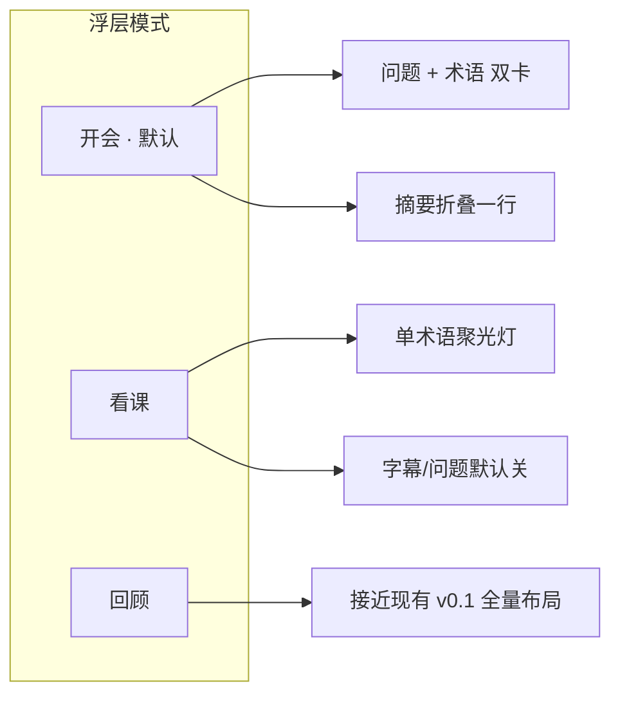
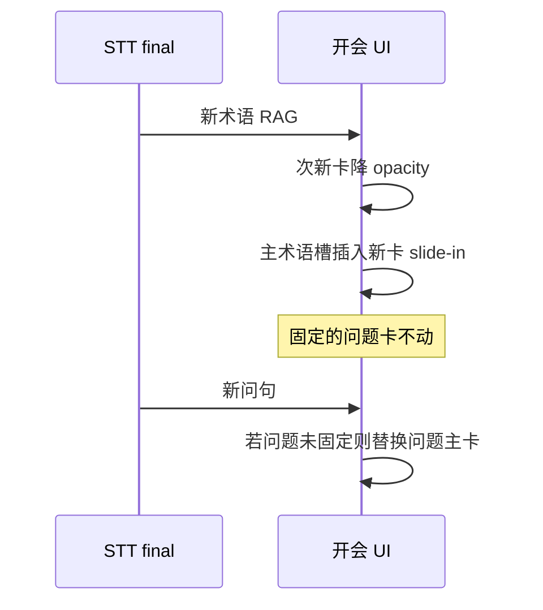

# Themis 浮层 UI 模式设计（草图 v0.1）

> **目标**：减少「目不暇接」与布局跳动，对齐主场景——**开会**（术语 + 问句快懂）优先，**看课**（单术语扫一眼）其次。  
> **状态**：设计稿，待实现。实现入口：`apps/themis-tray/`（`index.html`、`main.js`、`styles.css`）。

---

## 1. 设计原则

| 原则 | 说明 |
|------|------|
| **采集时可复杂，观看时必须极简** | 正常采集中主界面 ≤3 个视觉焦点 |
| **新信息追加，不整页重排** | 洞察卡片增量插入；总结用「已更新」提示而非整块替换 |
| **模式显式切换** | 用户知道当前是「开会 / 看课 / 回顾」，可记忆上次选择 |
| **运维信息下沉** | 配置 chips、peak/frames 仅在异常或「诊断」中展示 |

---

## 2. 模式总览



| 模式 | 默认场景 | 主屏信息 | 次要（折叠/菜单） |
|------|----------|----------|-------------------|
| **开会** | Zoom/Teams、技术讨论 | 最新 **问句+短答**、最新 **1–2 术语** | 摘要一行、字幕可展开 |
| **看课** | 视频、播客、网课 | **当前术语** 大字 + 可选上一词 | 一切其余默认隐藏 |
| **回顾** | 会后整理 | 全文总结 + 字幕 + 历史洞察列表 | 与现布局接近，供 power user |

**模式切换位置**：标题栏左侧，品牌名右侧 — 分段控件 `开会 | 看课 | 回顾`（或下拉 + 记住 `localStorage: themis-ui-mode`）。

---

## 3. 共用 chrome（三种模式一致）

### 3.1 标题栏 — 单行紧凑

```
┌──────────────────────────────────────────────────────────────────────────┐
│ Themis   [开会|看课|回顾]     ● 采集中          [捕捉] [⋯]              │
└──────────────────────────────────────────────────────────────────────────┘
```

| 元素 | 行为 |
|------|------|
| `● 采集中` | 仅圆点 + 短文案；详情进 tooltip。**未配置**时变橙 +「配置」链到设置 |
| `[捕捉]` | 同现「捕捉/停止」，快捷键 T |
| `[⋯]` | 溢出菜单：诊断、配置、中文、清空、透/字、浮、尺寸、隐藏、退出 |

**移除主屏常驻**：第二行 header、theme-badge 可进 ⋯；`config-status` 整行（配置好后不出现）。

### 3.2 状态与动画

- 采集中：**无** peak 数字脉冲（`prefers-reduced-motion` 时全局减动画）。
- 新洞察：卡片 **右侧/下方滑入**（`transform`），旧卡 **opacity 降低**，不 `replaceChildren` 整表重绘。
- 唤醒浮层：细边框闪 300ms，不用整窗 scale pulse。

---

## 4. 开会模式（优先）— 主草图

### 4.1 布局（默认窗口约 520×380，可拖拽分栏）

```
┌──────────────────────────────────────────────────────────────────────────┐
│ Themis  [开会|看课|回顾]   ● 采集中                    [捕捉] [⋯]       │
├──────────────────────────────────────────────────────────────────────────┤
│ 📋 会话摘要  已更新 · 点击展开 ▾                                          │  ← 折叠，默认 1 行
├───────────────────────────────┬──────────────────────────────────────────┤
│  当前问题                      │  术语                                      │
│ ┌───────────────────────────┐ │ ┌────────────────────────────────────────┐ │
│ │ Q  Why use CRDT here?     │ │ │ RAG                                    │ │
│ │ A  冲突无关复制类型，适合…  │ │ │ 检索增强生成：先查知识库再生成回答…      │ │
│ │ [回答思路][📌][复制][忽略]   │ │ │ [扫盲][进阶][更详细][📌][复制][知道了] │ │
│ └───────────────────────────┘ │ └────────────────────────────────────────┘ │
│                               │ ┌────────────────────────────────────────┐ │
│  (空时：监听问句中…)           │ │ KV cache  (次新，半透明 85%)            │ │
│                               │ └────────────────────────────────────────┘ │
├───────────────────────────────┴──────────────────────────────────────────┤
│ 实时字幕 ▾  (默认折叠，展开后占底部 ~30%)                                  │
└──────────────────────────────────────────────────────────────────────────┘
```

### 4.2 区域说明

| 区域 | 规则 |
|------|------|
| **当前问题** | 列表展示未固定问句；**忽略** 移出列表且本场同问句不再弹出；📌 固定后进入底部「已固定」栏 |
| **术语** | 主卡 1 + 次新 1（半透明、字号略小）；最多同时 2 张可见，其余进「更多术语 (3)」抽屉 |
| **会话摘要** | 默认 **一行**：`已更新 14:32 · 点击展开`；展开后为可滚动区，更新时 **追加段落** 或显示 `+2 条新要点`，不整段闪烁替换 |
| **实时字幕** | **默认折叠**；开会需要核对原话时展开；partial 更新 **不触发** 自动滚到底（仅 final 滚一行） |

### 4.3 新内容到达时的行为（减跳动）



### 4.4 快捷操作

| 操作 | 说明 |
|------|------|
| 📌 固定 | 保留现逻辑，图标更明显 |
| 复制 | 复制「词 + 解释」或「问 + 答」到剪贴板 |
| 更详细 | 同现 `expand_insight`，展开 **就地** 向下长高，不挤走另一栏 |
| 冻结 | ⋯ 菜单或 `F`：暂停术语/问题自动过期（dwell 计时停） |

### 4.5 与现 v0.1 差异

| 现 v0.1 | 开会模式 |
|---------|----------|
| Questions + Terms + Keywords 三列竞争 | Keywords **默认无**；Terms 最多 2 卡 |
| 全文总结占大块且 periodic 整段替换 | 折叠 1 行 + 增量更新 |
| 双 status 行 + 双行 header | 单 status 点 + 单行 header |
| 字幕常开、自动跟滚 | 默认关、减滚 |

---

## 5. 看课模式 — 主草图

### 5.1 布局（窄条优先，约 400×120 或用户拖大）

```
┌──────────────────────────────────────────────────────────────────────────┐
│ Themis  [开会|看课|回顾]   ● 采集中                    [捕捉] [⋯]       │
├──────────────────────────────────────────────────────────────────────────┤
│                                                                          │
│   RAG                                                                    │
│   检索增强生成：从外部知识库检索相关片段，再交给大模型生成回答。              │
│                                                                          │
│   ─ ─ ─ ─ ─ ─ ─ ─ ─ ─ ─ ─ ─ ─ ─ ─ ─ ─ ─ ─ ─ ─ ─ ─ ─ ─ ─ ─ ─ ─ ─ ─ ─   │
│   上一词：KV cache · 键值缓存，用于加速推理…          [📌] [复制] [更多术语] │
│                                                                          │
└──────────────────────────────────────────────────────────────────────────┘
```

### 5.2 区域说明

| 元素 | 规则 |
|------|------|
| **主术语** | 仅 **1 条**，词名 18–20px，解释 2–3 行截断 +「更详细」 |
| **上一词** | 单行次要样式；点击可 **提升为主卡** |
| **新词 toast**（可选） | 3s 右上角小条：`新术语：CRDT` → 点击切到主卡；不推动主布局 |
| **隐藏** | 无 Questions、无摘要、无字幕、无 Keywords |
| **窗口** | 推荐默认 preset「窄条 / 底部贴边」；全屏视频时配合 **浮** 模式 |

### 5.3 看课 vs 开会

| | 开会 | 看课 |
|---|------|------|
| 宽度 | 双栏 | 单栏窄条 |
| 问题 | 主栏左侧 | 无 |
| 术语数 | 2 | 1 (+ 上一词一行) |
| 摘要 | 折叠 1 行 | 无 |
| 字幕 | 可展开 | 无（⋯ 里可强制打开） |

---

## 6. 回顾模式（简草图）

保持接近现有全量布局，便于会后检索：

```
┌─ header 单行 + 模式切换 ─────────────────────────────────────────────┐
│ 全文总结（展开，可滚动）                                                │
├─ Questions 列表（可滚动，显示多条历史）─┬─ Terms 列表 + Keywords ───┤
├─ 实时字幕（展开，跟滚）───────────────────────────────────────────────┤
└──────────────────────────────────────────────────────────────────────┘
```

洞察列表允许 **多条 + 时间戳**；dwell 过期可关闭或延长。

---

## 7. 组件状态（实现参考）

### 7.1 CSS 类名建议

```text
body.ui-mode-meeting | body.ui-mode-glance | body.ui-mode-review
.summary-panel.is-collapsed
.transcript-block.is-collapsed
.insight-card.is-primary | .is-secondary | .is-pinned
.insight-toast (看课新词)
.status-compact
.header-compact
```

### 7.2 `renderInsightPanels` 分支

| 模式 | 渲染策略 |
|------|----------|
| meeting | `renderMeetingPanels()` — 问题 1 卡 + 术语 ≤2 卡，增量 DOM |
| glance | `renderGlancePanel()` — 主 + 上一词，无 questions 容器 |
| review | `renderReviewPanels()` — 现逻辑，列表可滚动 |

### 7.3 存储

| Key | 值 |
|-----|-----|
| `themis-ui-mode` | `meeting` \| `glance` \| `review` |
| `themis-summary-collapsed` | `true` \| `false` |
| `themis-transcript-collapsed` | 开会默认 `true` |

---

## 8. 实现分期（建议）

| 阶段 | 内容 | 产出 |
|------|------|------|
| **P0** | 模式切换 + 单行 header + ⋯ 菜单 + 隐藏 config-status（已配置时） | 骨架可点 |
| **P1 开会** | 双栏 1+2 卡、摘要折叠、字幕默认折、增量洞察渲染 | **优先交付** |
| **P2 看课** | 单术语 + 上一词 + 窄条 preset | 第二交付 |
| **P3** | 回顾模式、冻结、复制、toast、reduced-motion | 打磨 |

---

## 9. 线框对照（当前 → 开会）

**当前 v0.1（信息过载）**

```
[两行 header + 10 按钮]
[status 行] [config 行]
[全文总结 大块]
[Questions | Terms/Keywords]
[实时字幕 常开]
```

**开会模式（目标）**

```
[单行 header + 模式切换]
[● 状态]
[摘要 1 行折叠]
[问题 1 卡 | 术语 2 卡]
[字幕 折叠]
```

---

## 10. 产品确认（2026-05-31）

1. **默认模式**：开会。
2. **Keywords**：主界面完全移除。
3. **术语**：扫盲 / 进阶切换；「知道了」后会话内不再显示该术语。
4. **问题**：「回答思路」按钮（`question_approach` LLM），非完整答案；「忽略」移出「当前问题」列表且本场同问句不再弹出。
5. **回顾模式**：暂缓。

实现文件：`apps/themis-tray/index.html`、`ui-modes.js`、`ui-modes.css`、`main.js`。

---

*文档版本：2026-05-31*
