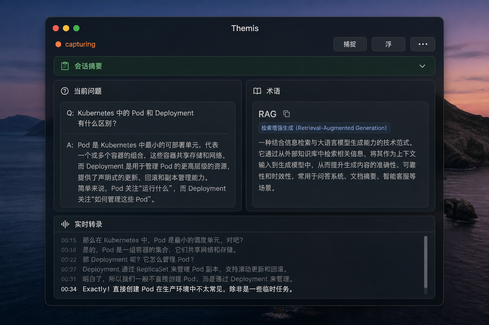
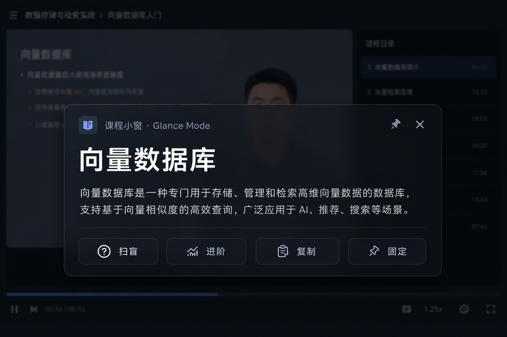
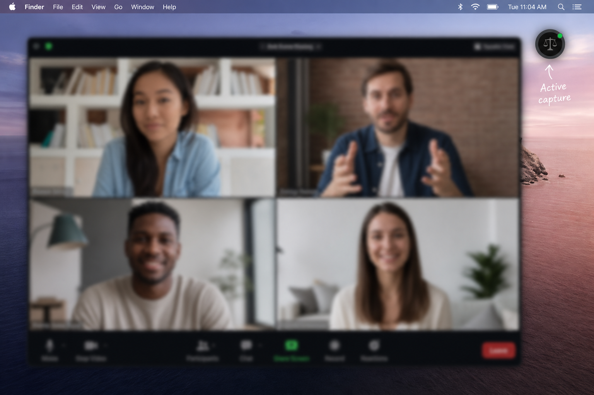

# Themis — 听不清？跟不上？让 AI 帮你「边听边懂」

> **Themis（忒弥斯）** 是一款面向 **Windows / macOS** 的桌面实时听写助手：抓取 **电脑正在播放的声音**（系统音频），必要时自动混入 **麦克风**，送入 Azure Speech 转写，并在 **始终置顶的半透明浮层** 里同步展示字幕、术语解释、问题初答与会话摘要。

不是录屏软件，不是重型会议套件，也不是 OCR 字幕提取器——**轻、快、贴边**，专为「需要听懂，但来不及查」的场景设计。



---

## 它解决什么痛点？

| 你在经历什么 | Themis 怎么做 |
|--------------|---------------|
| 看英文网课 / 技术播客，术语一闪而过，暂停查词打断节奏 | 系统 loopback 抓声 → 实时字幕 + **术语扫盲卡片**（Reg 自动纠成 RAG 等） |
| 线上会议里对方讲太快，专有名词听不懂 | 检测到 Zoom / Teams / 飞书等通话 app 时，**系统声 + 麦克风双路混音**，你说的话也会被转写 |
| 不想装一整套会议录制工具，只要「能看懂正在发生什么」 | **托盘 + 浮层**，后台 `themis-service` 负责采集与 STT，前台只占一条窗口 |
| 会议软件自带字幕质量差、或根本没有 | 直连 **Azure Speech**，支持 `auto` 中英混合识别与自定义纠错 |
| 屏幕已经够满，再来一个大窗口挡内容 | 可调 **透明度 / 字号 / 尺寸**，支持 **迷你浮标** 与 **居中 ⅓ 屏唤醒** |
| 会后想回顾「刚才那个词是什么意思」 | 术语 / 问题可 **📌 固定** 到底部栏，支持 **更详细 / 回答思路 / 一键复制** |

**不适合的场景（请诚实预期）：**

- 只有画面字幕、没有旁白音频 → 不做 OCR
- 完全离线 → 需要 Azure Speech（开发联调可用 Mock，无真实听写）

---

## 典型使用场景

### 🎓 看课 / 播客 / YouTube 技术内容

播放视频时启动 Themis，浮层贴在屏幕一侧：下方滚实时字幕，右侧弹出 **术语解释** 与 **技术问句短答**。切换到 **看课模式**，主区域只放大当前术语，减少信息干扰。



### 💼 线上会议（Zoom / Teams / 腾讯会议 / 飞书…）

默认 `THEMIS_AUDIO_CAPTURE_MODE=auto`：检测到通话类进程后，自动 **输出 + 麦克风** 双路混合——对方从扬声器出来的声音和你本地发言都会被转写。开会模式同时展示 **当前问题与术语**、可折叠 **会话摘要**，底部 **实时字幕** 持续滚动（见文首主界面图）。

需要尽量少挡画面时，可缩成 **迷你浮标**，全屏演示或看视频时仍能看见采集状态：



### 🛠 开发者自托管 / 可扩展

Rust 单体仓库、gRPC 本地通信、词表与启发式规则可改、可选 Azure OpenAI 增强 Insights——适合希望 **可控、可二次开发** 的团队。

---

## 界面要点（对照上图）

| 模式 | 你能看到什么 |
|------|----------------|
| **开会**（文首主图） | 顶部 **捕捉 / 浮 / 置顶 / 更多**；中部 **会话摘要**、**当前问题** 与 **术语**（带条数）；底部 **实时字幕** |
| **看课** | 单术语聚光灯 + 扫盲 / 进阶 / 复制 / 固定；侧栏与字幕默认收起 |
| **迷你浮标** | `Cmd+Shift+M` / `Ctrl+Shift+M` 缩成圆标；`Cmd+Shift+O` / `Ctrl+Shift+O` 唤醒主浮层 |

> UI 随版本迭代，以实际 Release 为准。

---

## 3 分钟上手

### 1. 获取程序

从 [GitHub Releases](https://github.com/huaiyizhu/Themis/releases) **按系统下载一个 ZIP**，解压后进入对应文件夹即可：

| 你的系统 | 下载 |
|----------|------|
| **Windows 64 位** | [`Themis-windows-x86_64.zip`](https://github.com/huaiyizhu/Themis/releases/latest) |
| **macOS Apple Silicon**（M1/M2/M3/M4） | `Themis-macos-aarch64.zip` |
| **macOS Intel** | `Themis-macos-x86_64.zip` |

解压后文件夹内已包含 **themis-tray**、**themis-service**、**README.md**、**.env.example**；无需再从二十多个平铺文件里挑选。

| 平台 | 解压后运行 |
|------|------------|
| Windows | 进入 `Themis-Windows/`，双击 `themis-tray.exe` |
| macOS | 进入 `Themis-macOS-Apple-Silicon/`（或 `Intel/`），`chmod +x themis-tray themis-service && xattr -cr . && ./themis-tray` |

> **macOS 提示「已损坏」？** Safari 下载隔离，执行 `xattr -cr .`（在解压后的文件夹内）或见文件夹内 `README.md`。

详见 [README §2 安装与使用](README.md#2-安装与使用release-版)。

### 2. 配置 Azure Speech

```bash
cp .env.example .env
# 编辑至少两项：
# AZURE_SPEECH_KEY=你的_key
# AZURE_SPEECH_REGION=eastus
```

可选：配置 `FOUNDRY_*`（Azure OpenAI）增强术语解释、问题初答与会话摘要。

`.env` 放在 **可执行文件同目录** 最省心；改配置后需 **重启 service**。

### 3. 启动并开始听写

**Windows**

```powershell
.\themis-tray.exe
# 或开发：.\scripts\themis.ps1 tray
```

**macOS**

```bash
./themis-tray
# 或：./scripts/themis.sh tray
```

首次 macOS 需授予 **系统音频录制** 权限（Process Tap）。

### 4. 日常操作

| 操作 | macOS | Windows |
|------|-------|---------|
| 开始 / 停止采集 | `Cmd+Shift+T` | `Ctrl+Shift+T` |
| 唤醒浮层（居中 ⅓ 屏） | `Cmd+Shift+O` | `Ctrl+Shift+O` |
| 迷你浮标 | `Cmd+Shift+M` | `Ctrl+Shift+M` |
| 延迟诊断 | `Cmd+Shift+D` | `Ctrl+Shift+D` |
| 显示 / 隐藏字幕区 | `Cmd+Shift+H` | `Ctrl+Shift+H` |

托盘 **左键** 显示/隐藏浮层，**右键** 菜单可切换采集。

### 5. 快速自检

```bash
./themis-cli doctor          # 配置是否齐全
./themis-cli audio-probe --seconds 8   # 播放 YouTube 时 peak 应 > 200
./themis-cli status          # 服务与采集状态
```

---

## 技术栈与架构

Themis 采用 **「后台服务 + 桌面浮层」** 分离设计：采集、STT、分析在 Rust 守护进程完成；UI 通过 gRPC 订阅流式结果，互不阻塞。

### 技术栈

| 层级 | 技术 |
|------|------|
| 桌面壳 | **Tauri 2** + HTML / CSS / JavaScript（`apps/themis-tray`） |
| 后台服务 | **Rust**（`themis-service`） |
| 音频采集 | Windows **WASAPI loopback**；macOS **Process Tap**（14.2+） |
| 语音识别 | **Azure Speech**（REST 分块 / 可选 streaming） |
| 智能分析 | 启发式词表 + 正则问句 + 可选 **Azure OpenAI**（`FOUNDRY_*`） |
| 进程通信 | **gRPC**（默认 `127.0.0.1:50051`） |
| CLI / 运维 | `themis-cli`（doctor、status、audio-probe、服务安装） |
| CI / 发布 | GitHub Actions（`ci.yml` + 标签 `v*` 触发 `release.yml`） |

### 端到端数据流

```
┌─────────────────────┐
│ 系统播放声（输出）   │──┐
└─────────────────────┘  │   WASAPI loopback /     ┌──────────────────────────────┐
                         ├── Process Tap ────────► │  themis-service              │
┌─────────────────────┐  │   （可选混音）           │  重采样 16 kHz → Azure STT   │
│ 麦克风（输入，可选） │──┘                         │  → Insights 分析 (可选 LLM)  │
└─────────────────────┘                            └────────┬─────────────────────┘
                                                            │ gRPC 流式推送
                                                   ┌────────▼─────────┐
                                                   │  themis-tray     │
                                                   │  浮层 · 托盘 · 快捷键 │
                                                   └──────────────────┘
```

### Insights 分析流（低延迟优先）

```
Azure STT 输出 is_final 句子
        │
        ▼
themis-service ──► 先推送 gRPC（仅 text）──► 浮层立刻显示字幕
        │
        │ 异步 analyze(text)
        ▼
themis-analysis
  ① 启发式（词表 + 正则问句）— 必跑
  ② LLM（FOUNDRY_*）— 可选
        │
        ▼
再推送 gRPC（text + insights_json）──► 侧栏 Terms / Questions + 会话摘要
```

**设计要点：** 字幕先出、Insights 后补，避免等 LLM 才显示文字；final 句才触发分析，partial 仅用于实时预览。

### 模块一览

| 组件 | 路径 | 职责 |
|------|------|------|
| `themis-core` | `crates/themis-core` | 配置、状态机、`.env` 加载 |
| `themis-audio` | `crates/themis-audio` | 系统输出 loopback / Process Tap；通话 app 检测；双路混音 |
| `themis-azure` | `crates/themis-azure` | Azure Speech + Mock + 术语纠错 |
| `themis-analysis` | `crates/themis-analysis` | 启发式 + 词表 + 可选 LLM |
| `themis-ipc` | `crates/themis-ipc` | gRPC proto / 客户端 / 服务端 |
| `themis-service` | `crates/themis-service` | 后台：采集 → STT → 分析 → 推送 |
| `themis-cli` | `crates/themis-cli` | 诊断、状态、音频自检、服务安装 |
| `themis-tray` | `apps/themis-tray` | Tauri 托盘、浮层 UI、全局快捷键 |

更细文档：[docs/architecture.md](docs/architecture.md) · [docs/platform-notes.md](docs/platform-notes.md) · [docs/ui-modes-design.md](docs/ui-modes-design.md)

### 部署方式

| 模式 | 说明 |
|------|------|
| **便携（默认）** | 只跑 `themis-tray`；若无 gRPC 则同目录自动拉起 `themis-service` |
| **Windows 服务** | `themis-cli service install`（需管理员） |
| **macOS LaunchAgent** | `themis-cli agent install` |

---

## 为什么选 Themis，而不是「再开一个 Tab」？

- **抓的是系统正在播放的声音**，不是麦克风全程录音——看课时不说话也能转写
- **会议场景自动双路**，无需手动选设备
- **浮层可透明、可缩小、可固定术语**，为「边看边懂」而不是为「录下来以后再看」
- **Rust 后台 + 本地 gRPC**，资源占用可控；开源可审计、可自托管

---

## 立即开始

1. 克隆或下载 Release：[GitHub Releases](https://github.com/huaiyizhu/Themis/releases)
2. 配置 `.env` 中的 Azure Speech Key
3. 运行 `themis-tray`，按 `Cmd/Ctrl+Shift+T` 开始采集
4. 播放一段 YouTube 技术视频或加入一场线上会议——体验 **边听边懂**

完整安装、快捷键、音频模式与故障排查见 **[README.md](README.md)**。

---

<p align="center">
  <strong>Themis — 忒弥斯</strong><br/>
  实时听写 · 术语扫盲 · 问题初答 · 会话摘要<br/>
  <em>MIT License</em>
</p>
